# Cygnet SQLite Schema

The web interface stores the merged multilingual wordnet in a single SQLite
database (`cygnet.db`). The schema follows the
[Python `wn` module](https://github.com/goodmami/wn)'s SQLite layout where
possible, with modifications for Cygnet's merged, ILI-indexed structure.

The schema is optimized for size: text ID columns are omitted (the web
interface uses integer rowids for all lookups), language codes are
normalized into a lookup table, and only indexes needed by the web
interface are created.



The diagram source is in [`schema.mmd`](schema.mmd) (Mermaid format).
To regenerate the SVG after editing:

```sh
npx @mermaid-js/mermaid-cli -i conversion_scripts/schema.mmd -o conversion_scripts/schema.svg -b white
```

## Tables

### languages

Lookup table for language codes, referenced by integer FK from entries
and definitions.

```sql
CREATE TABLE languages (
    rowid INTEGER PRIMARY KEY,
    code  TEXT NOT NULL UNIQUE   -- ISO 639: "en", "de", "cmn-Hans"
);
```

```
rowid  code
─────  ────────
1      ckb
2      de
3      en
...
```

### synsets

A synset (= Cygnet Concept) groups senses that share a meaning.

```sql
CREATE TABLE synsets (
    rowid INTEGER PRIMARY KEY,
    ili   TEXT,           -- bare ILI identifier: "i85041"
    pos   TEXT NOT NULL   -- NOUN, VERB, ADJ, ADV, ...
);
```

```
rowid  ili     pos
─────  ──────  ────
1      i1      ADJ
35549  i35549  NOUN
```

**Differs from `wn`:** no `lexicon_rowid` (Cygnet merges all wordnets).
No text `id` column (saves ~4 MB; ILI is used for display).

### entries

An entry (= Cygnet Lexeme) is a word in a specific language with a
grammatical category.

```sql
CREATE TABLE entries (
    rowid          INTEGER PRIMARY KEY,
    language_rowid INTEGER NOT NULL REFERENCES languages(rowid),
    pos            TEXT NOT NULL   -- NOUN, VERB, ADJ, ADV, ...
);
```

```
rowid   language_rowid  pos
──────  ──────────────  ────
88234   3               NOUN
```

**Differs from `wn`:** `language_rowid` FK instead of text (in `wn`,
language comes from a `lexicons` table). No text `id` column (saves
~80 MB).

### forms

Surface forms (wordforms) for an entry. Rank 0 is the lemma (citation form);
higher ranks are inflected/variant forms.

```sql
CREATE TABLE forms (
    rowid           INTEGER PRIMARY KEY,
    entry_rowid     INTEGER NOT NULL REFERENCES entries(rowid),
    form            TEXT NOT NULL,     -- surface form: "banks"
    normalized_form TEXT,              -- accent-stripped lowercase: "banks"
    rank            INTEGER DEFAULT 1  -- 0 = lemma
);
```

```
rowid  entry_rowid  form   normalized_form  rank
─────  ───────────  ─────  ───────────────  ────
1      88234        bank   bank             0
2      88234        banks  banks            1
```

**Differs from `wn`:** added `normalized_form` for accent-insensitive
search. No UNIQUE constraint (duplicates filtered at insert time).

### senses

A sense links an entry to a synset -- it represents one meaning of a word.

```sql
CREATE TABLE senses (
    rowid        INTEGER PRIMARY KEY,
    entry_rowid  INTEGER NOT NULL REFERENCES entries(rowid),
    synset_rowid INTEGER NOT NULL REFERENCES synsets(rowid),
    sense_index  INTEGER DEFAULT 1   -- disambiguation: bank_1 vs bank_2
);
```

```
rowid   entry_rowid  synset_rowid  sense_index
──────  ───────────  ────────────  ───────────
127932  88234        35549         1
127933  88234        31364         2
```

`sense_index` is computed per (language, lemma, pos) group, so English
"bank" as a noun has indices 1--18 while German "Bank" as a noun has 1--3.

**Differs from `wn`:** no text `id` column (saves ~149 MB).

### definitions

Definitions (= Cygnet Glosses) for a synset in a given language.

```sql
CREATE TABLE definitions (
    rowid          INTEGER PRIMARY KEY,
    synset_rowid   INTEGER NOT NULL REFERENCES synsets(rowid),
    definition     TEXT,
    language_rowid INTEGER REFERENCES languages(rowid)
);
```

```
rowid  synset_rowid  definition                                                   language_rowid
─────  ────────────  ──────────────────────────────────────────────────────────── ──────────────
1      1             (usually followed by `to') having the necessary means or ... 3
```

A synset may have definitions in multiple languages.

### synset_relations

Directed relations between synsets (hypernymy, meronymy, etc.).
Both forward and inverse directions are stored explicitly.

```sql
CREATE TABLE synset_relations (
    rowid        INTEGER PRIMARY KEY,
    source_rowid INTEGER NOT NULL REFERENCES synsets(rowid),
    target_rowid INTEGER NOT NULL REFERENCES synsets(rowid),
    type_rowid   INTEGER NOT NULL REFERENCES relation_types(rowid)
);
```

### sense_relations

Directed relations between senses (antonymy, derivation, etc.).

```sql
CREATE TABLE sense_relations (
    rowid        INTEGER PRIMARY KEY,
    source_rowid INTEGER NOT NULL REFERENCES senses(rowid),
    target_rowid INTEGER NOT NULL REFERENCES senses(rowid),
    type_rowid   INTEGER NOT NULL REFERENCES relation_types(rowid)
);
```

### relation_types

Lookup table mapping relation type names to integer IDs.

```
rowid  type
─────  ──────────────────
1      antonym
2      derivation
3      derivation_of
4      pertainym
...
9      class_hypernym
10     class_hyponym
```

22 types total: antonym, derivation, derivation_of, pertainym, pertainym_of,
participle, participle_of, opposite, class_hypernym, class_hyponym,
part_meronym, part_holonym, member_meronym, member_holonym, entails,
entailed_by, substance_meronym, substance_holonym, causes, caused_by,
instance_hypernym, instance_hyponym.

### examples

Example sentences, stored once and linked to senses via a junction table.

```sql
CREATE TABLE examples (
    rowid   INTEGER PRIMARY KEY,
    example TEXT NOT NULL   -- "they pulled the canoe up on the bank"
);

CREATE TABLE sense_examples (
    rowid         INTEGER PRIMARY KEY,
    sense_rowid   INTEGER NOT NULL REFERENCES senses(rowid),
    example_rowid INTEGER NOT NULL REFERENCES examples(rowid)
);
```

### example_annotations

Character-offset annotations marking which token in an example corresponds
to which sense.

```sql
CREATE TABLE example_annotations (
    rowid         INTEGER PRIMARY KEY,
    example_rowid INTEGER NOT NULL REFERENCES examples(rowid),
    start_offset  INTEGER NOT NULL,
    end_offset    INTEGER NOT NULL,
    sense_rowid   INTEGER NOT NULL REFERENCES senses(rowid)
);
```

```
example_rowid  start_offset  end_offset  sense_rowid
─────────────  ────────────  ──────────  ───────────
1              32            36          127932
```

This means characters 32--36 of example 1 ("bank") are annotated as
sense 127932.

### definition_annotations

Same structure as example_annotations, for definitions. Currently empty
(no definition annotations in the source data).

```sql
CREATE TABLE definition_annotations (
    rowid            INTEGER PRIMARY KEY,
    definition_rowid INTEGER NOT NULL REFERENCES definitions(rowid),
    start_offset     INTEGER NOT NULL,
    end_offset       INTEGER NOT NULL,
    sense_rowid      INTEGER NOT NULL REFERENCES senses(rowid)
);
```

## Example queries

### Look up a word

```sql
-- Find all English senses of "bank"
SELECT s.rowid, f.form, l.code as language, syn.pos, s.sense_index
FROM forms f
JOIN entries e ON f.entry_rowid = e.rowid
JOIN languages l ON e.language_rowid = l.rowid
JOIN senses s ON s.entry_rowid = e.rowid
JOIN synsets syn ON s.synset_rowid = syn.rowid
WHERE f.normalized_form = 'bank' AND l.code = 'en';
```

```
rowid   form  language  pos   sense_index
──────  ────  ────────  ────  ───────────
127932  bank  en        NOUN  1
127933  bank  en        NOUN  2
...
127949  bank  en        VERB  1
```

### Get definitions for a synset

```sql
SELECT l.code as language, d.definition
FROM definitions d
JOIN languages l ON d.language_rowid = l.rowid
WHERE d.synset_rowid = 35549
ORDER BY l.code;
```

```
language  definition
────────  ──────────────────────────────────────────────────
bg        Място в непосредствена близост до море или река.
ca        Terra inclinada (especialment la que se troba al...
en        sloping land (especially the slope beside a body of water)
ro        Perete, margine (abruptă) a unui râu, ...
```

### Get examples with annotations for a sense

```sql
SELECT e.example, ea.start_offset, ea.end_offset
FROM examples e
JOIN sense_examples se ON se.example_rowid = e.rowid
JOIN example_annotations ea ON ea.example_rowid = e.rowid
    AND ea.sense_rowid = se.sense_rowid
WHERE se.sense_rowid = 127932;
```

```
example                                start_offset  end_offset
─────────────────────────────────────  ────────────  ──────────
they pulled the canoe up on the bank   32            36
he sat on the bank of the river and    14            18
```

## Indexes

Only indexes used by the web interface are created:

| Index | Column(s) | Purpose |
|---|---|---|
| `idx_forms_normalized` | `forms.normalized_form` | Word search |
| `idx_forms_entry` | `forms.entry_rowid` | Look up forms for an entry |
| `idx_senses_entry` | `senses.entry_rowid` | Look up senses for an entry |
| `idx_senses_synset` | `senses.synset_rowid` | Look up senses for a synset |
| `idx_definitions_synset` | `definitions.synset_rowid` | Definitions for a synset |
| `idx_synset_relations_source` | `synset_relations.source_rowid` | Outgoing synset relations |
| `idx_sense_relations_source` | `sense_relations.source_rowid` | Outgoing sense relations |
| `idx_sense_examples_sense` | `sense_examples.sense_rowid` | Examples for a sense |
| `idx_example_annotations_example` | `example_annotations.example_rowid` | Annotations for an example |

## Differences from `wn` module schema

| `wn` module | Cygnet DB | Reason |
|---|---|---|
| `lexicons` table with `language` | `languages` lookup table | Cygnet merges all wordnets; no per-lexicon metadata |
| `lexicon_rowid` FK on most tables | absent | Single merged resource |
| Text `id` column on synsets, entries, senses | absent | Saves ~232 MB; web interface uses integer rowids |
| `forms` UNIQUE(entry_rowid, form) | no constraint | Saves ~35 MB autoindex; dupes filtered at insert |
| language as TEXT in entries, definitions | `language_rowid` INTEGER FK | Saves ~20 MB |
