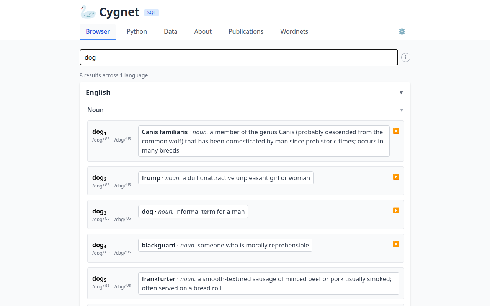
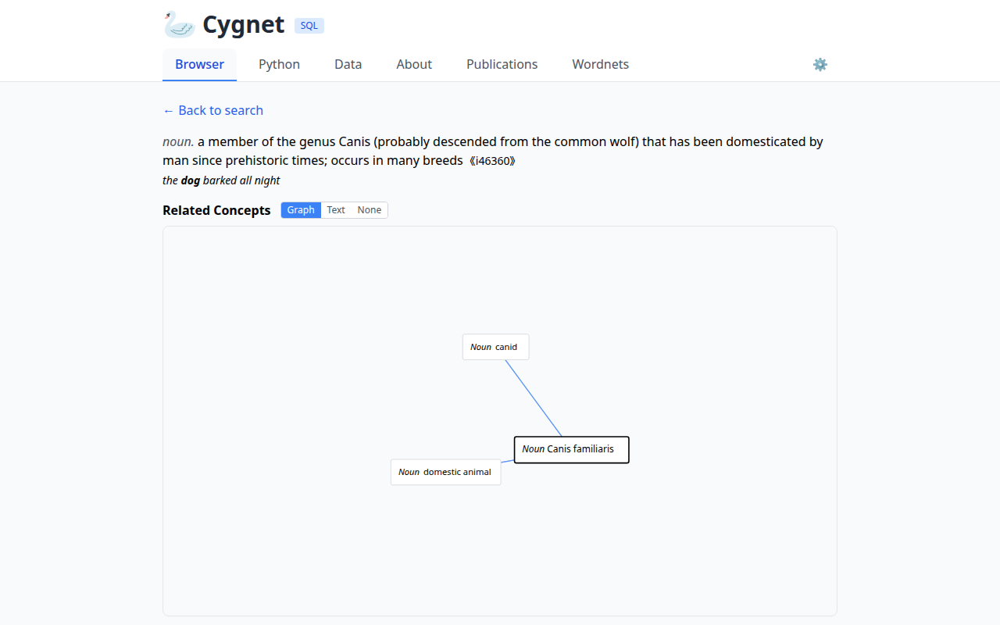

# Cygnet Database API

*2026-03-06T20:28:17Z by Showboat 0.6.1*
<!-- showboat-id: 9d9dd51d-13e4-454b-8253-3ce63b53a0ef -->

Cygnet exposes its data as a plain SQLite database (web/cygnet.db). Any SQLite client can query it directly. This document shows the key tables and common query patterns.

## Connecting

```python3

import sqlite3
con = sqlite3.connect('web/cygnet.db')
con.row_factory = sqlite3.Row
print('Connected to cygnet.db')

```

```output
Connected to cygnet.db
```

## Database statistics

The top-level counts give a quick overview of the resource.

```python3

import sqlite3
con = sqlite3.connect('web/cygnet.db')
stats = {
    'synsets':   con.execute('SELECT COUNT(*) FROM synsets').fetchone()[0],
    'entries':   con.execute('SELECT COUNT(*) FROM entries').fetchone()[0],
    'senses':    con.execute('SELECT COUNT(*) FROM senses').fetchone()[0],
    'languages': con.execute('SELECT COUNT(DISTINCT language_rowid) FROM entries').fetchone()[0],
    'resources': con.execute('SELECT COUNT(*) FROM resources').fetchone()[0],
}
for k, v in stats.items():
    print(f'{k:12s} {v:>10,}')

```

```output
synsets         121,085
entries       1,212,615
senses        1,751,314
languages            30
resources            34
```

## Per-resource coverage

Each resource row records how many synsets it covers and how many senses it contributes.

```python3

import sqlite3
con = sqlite3.connect('web/cygnet.db')
rows = con.execute('''
    SELECT r.code, l.code AS lang, r.synset_count, r.sense_count
    FROM resources r
    LEFT JOIN languages l ON r.language_rowid = l.rowid
    ORDER BY r.sense_count DESC
    LIMIT 10
''').fetchall()
print(f'{'Resource':<20} {'Lang':<6} {'Synsets':>10} {'Senses':>10}')
print('-' * 50)
for code, lang, sc, se in rows:
    print(f'{code:<20} {lang or "":<6} {sc or 0:>10,} {se or 0:>10,}')

```

```output
Resource             Lang      Synsets     Senses
--------------------------------------------------
omw-fi               fi        116,763    189,226
oewn                 en        107,519    185,129
omw-es               es         78,417    145,641
odenet               de         19,717    144,440
omw-fr               fr         59,091    102,647
omw-ca               ca         60,462    100,120
omw-th               th         73,350     95,517
omw-ro               ro         56,026     84,638
omw-cmn              cmn-Hans     42,300     79,797
omw-pt               pt         43,895     74,012
```

## Looking up a word

Search for all senses of a word across languages.

```python3

import sqlite3
con = sqlite3.connect('web/cygnet.db')
rows = con.execute('''
    SELECT l.code AS lang, f.form, s.sense_index,
           substr(d.definition, 1, 60) AS definition
    FROM forms f
    JOIN entries e  ON f.entry_rowid  = e.rowid
    JOIN languages l ON e.language_rowid = l.rowid
    JOIN senses s   ON s.entry_rowid  = e.rowid
    JOIN synsets sy ON s.synset_rowid = sy.rowid
    LEFT JOIN definitions d ON d.synset_rowid = sy.rowid AND d.language_rowid = (
        SELECT rowid FROM languages WHERE code = 'en' LIMIT 1
    )
    WHERE f.normalized_form = 'dog'
    ORDER BY lang, s.sense_index
''').fetchall()
for lang, form, idx, defn in rows:
    print(f'[{lang}] {form}#{idx}  {defn or ""}...')

```

```output
[en] dog#1  a member of the genus Canis (probably descended from the com...
[en] dog#1  go after with the intent to catch...
[en] dog#2  a dull unattractive unpleasant girl or woman...
[en] dog#3  informal term for a man...
[en] dog#4  someone who is morally reprehensible...
[en] dog#5  a smooth-textured sausage of minced beef or pork usually smo...
[en] dog#6  a hinged catch that fits into a notch of a ratchet to move a...
[en] dog#7  metal supports for logs in a fireplace...
```

## ILI lookup

Every synset has an ILI (Interlingual Index) identifier. Use it to find all translations of a concept.

```python3

import sqlite3
con = sqlite3.connect('web/cygnet.db')

# find the ILI for 'dog' (sense #1)
ili = con.execute('''
    SELECT sy.ili FROM synsets sy
    JOIN senses s  ON s.synset_rowid = sy.rowid
    JOIN entries e ON s.entry_rowid  = e.rowid
    JOIN forms f   ON f.entry_rowid  = e.rowid
    JOIN languages l ON e.language_rowid = l.rowid
    WHERE f.normalized_form = 'dog' AND l.code = 'en' AND s.sense_index = 1
    LIMIT 1
''').fetchone()[0]
print(f'ILI for dog#1: {ili}')

# fetch all translations
rows = con.execute('''
    SELECT l.code, GROUP_CONCAT(DISTINCT f.form) AS forms
    FROM synsets sy
    JOIN senses s  ON s.synset_rowid = sy.rowid
    JOIN entries e ON s.entry_rowid  = e.rowid
    JOIN forms f   ON f.entry_rowid  = e.rowid
    JOIN languages l ON e.language_rowid = l.rowid
    WHERE sy.ili = ?
    GROUP BY l.code
    ORDER BY l.code
''', (ili,)).fetchall()
for lang, forms in rows:
    print(f'  {lang}: {forms}')

```

```output
ILI for dog#1: i46360
  arb: كلْب,كلب,كلاب
  bg: куче
  ca: gossa,Canis familiaris,canis familiaris,ca,gos,gos domèstic
  cmn-Hans: 犬,狗
  da: hund,køter,vovhund,vovse
  el: σκύλος γένους Canis familiaris
  en: Canis familiaris,dog,domestic dog
  es: perra,can,canino,canis familiaris,perro,perro doméstico,perros
  eu: or,txakur,zakur
  fi: koira,Canis familiaris
  fr: chien,canis familiaris
  gl: Canis familiaris,cadela,can
  hr: Canis lupus familiaris,domaći pas,pas
  is: rakki,hvutti,hundur,seppi
  it: cane,Canis familiaris
  lt: šuo
  nb: bisk,hund,kjøter
  nl: joekel,hond
  nn: bisk,hund,kjøter
  pl: pies,pies domowy
  pt: cão,cachorra,cachorro,cadela
  ro: câine
  sk: pes,pes domáci (Canis familiaris)
  sl: canis familiaris,pes
  sv: hund
  th: สุนัข,หมา,หมาบ้าน
```

## Hypernym path

Traverse IS-A relations upward from a synset to find its ancestor chain.

```python3

import sqlite3
con = sqlite3.connect('web/cygnet.db')

# resolve the rowid of the class_hypernym relation type
hypernym_type = con.execute(
    "SELECT rowid FROM relation_types WHERE type = 'class_hypernym'"
).fetchone()[0]

def hypernym_chain(ili: str) -> list[str]:
    visited, chain = set(), []
    rowid = con.execute('SELECT rowid FROM synsets WHERE ili = ?', (ili,)).fetchone()[0]
    while rowid and rowid not in visited:
        visited.add(rowid)
        ili_val = con.execute('SELECT ili FROM synsets WHERE rowid = ?', (rowid,)).fetchone()[0]
        defn = con.execute(
            'SELECT definition FROM definitions WHERE synset_rowid = ? LIMIT 1', (rowid,)
        ).fetchone()
        chain.append(f'{ili_val}: {defn[0][:50] if defn else "(no definition)"}')
        parent = con.execute(
            'SELECT target_rowid FROM synset_relations WHERE source_rowid = ? AND type_rowid = ?',
            (rowid, hypernym_type)
        ).fetchone()
        rowid = parent[0] if parent else None
    return chain

for step in hypernym_chain('i46360'):
    print(' →', step)

```

```output
 → i46360: a member of the genus Canis (probably descended fr
 → i42269: any of various animals that have been tamed and ma
 → i35563: a living organism characterized by voluntary movem
 → i35553: a living thing that has (or can develop) the abili
 → i35552: a living (or once living) entity
 → i35550: an assemblage of parts that is regarded as a singl
 → i35549: a tangible and visible entity; an entity that can 
 → i35546: an entity that has physical existence
 → i35545: that which is perceived or known or inferred to ha
```

## Glob search

The `normalized_form` column stores lowercased, accent-stripped forms. Use SQLite's GLOB or LIKE for wildcard queries.

```python3

import sqlite3
con = sqlite3.connect('web/cygnet.db')
rows = con.execute('''
    SELECT DISTINCT f.form, l.code
    FROM forms f
    JOIN entries e  ON f.entry_rowid  = e.rowid
    JOIN languages l ON e.language_rowid = l.rowid
    WHERE f.normalized_form GLOB 'dog*' AND l.code = 'en'
    ORDER BY f.form
''').fetchall()
for form, lang in rows:
    print(f'  {form}')
print(f'({len(rows)} results)')

```

```output
  dog
  dog bent
  dog biscuit
  dog bite
  dog breeding
  dog catcher
  dog collar
  dog days
  dog do
  dog fennel
  dog flea
  dog food
  dog grass
  dog hobble
  dog hook
  dog house
  dog in the manger
  dog laurel
  dog mercury
  dog paddle
  dog pound
  dog racing
  dog rose
  dog shit
  dog show
  dog sled
  dog sleigh
  dog stinkhorn
  dog tag
  dog turd
  dog violet
  dog wrench
  dog's breakfast
  dog's dinner
  dog's mercury
  dog's-tooth check
  dog's-tooth violet
  dog-day cicada
  dog-ear
  dog-eared
  dog-iron
  dog-sized
  dog-tired
  dogbane
  dogcart
  doge
  dogfight
  dogfighter
  dogfish
  dogfishes
  dogged
  doggedly
  doggedness
  doggerel
  doggerel verse
  doggie
  doggie bag
  dogging
  doggo
  doggy
  doggy bag
  doggy do
  doghouse
  dogie
  dogleg
  doglike
  dogma
  dogmata
  dogmatic
  dogmatical
  dogmatically
  dogmatise
  dogmatism
  dogmatist
  dogmatize
  dogs-tooth check
  dogsbody
  dogshit
  dogsled
  dogstooth check
  dogteeth
  dogtooth
  dogtooth violet
  dogtrot
  dogwatch
  dogwood
  dogwood tree
  dogwood vodka
  dogy
(89 results)
```

## Definition search

Full-text search over definitions using LIKE.

```python3

import sqlite3
con = sqlite3.connect('web/cygnet.db')
rows = con.execute('''
    SELECT sy.ili, substr(d.definition, 1, 70)
    FROM definitions d
    JOIN synsets sy ON d.synset_rowid = sy.rowid
    JOIN languages l ON d.language_rowid = l.rowid
    WHERE l.code = 'en' AND d.definition LIKE '%domesticated animal%'
    LIMIT 8
''').fetchall()
for ili, defn in rows:
    print(f'  {ili}  {defn}')

```

```output
  i27509  give fodder (to domesticated animals)
  i42277  a domesticated animal kept for companionship or amusement
  i79778  a special variety of domesticated animals within a species
  None  small domesticated animals (chickens, geese, rabbits, hogs, ducks, pig
  None  a shelter for humans or domesticated animals and livestock based on a 
```

## Verify

Confirm all code blocks still produce the same output.

## Web UI

The same data is browsable via the web interface at [cygnet.fcbond.com](https://cygnet.fcbond.com). The search bar accepts exact words, glob patterns (`dog*`, `*ness`), ILI identifiers (`i46360`), and definition queries (`def:animal`).

```bash {image}

```



```bash {image}

```


